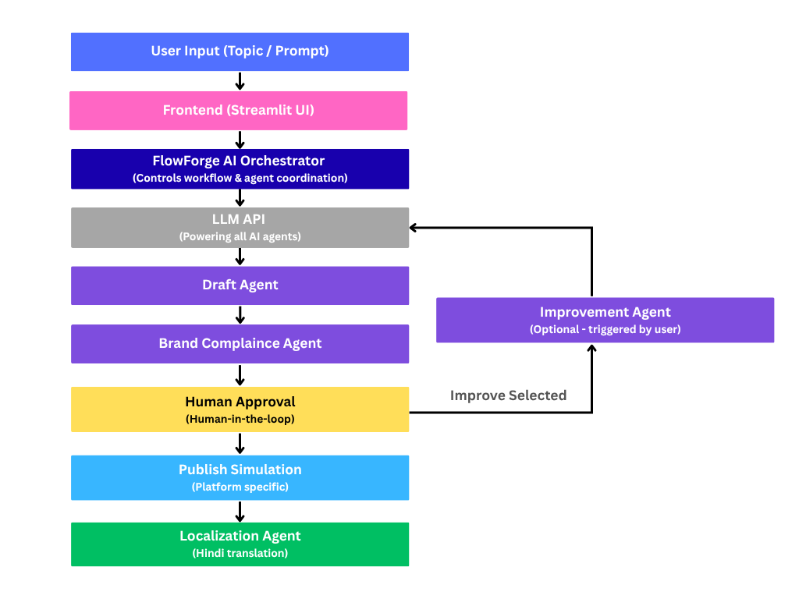

# 🚀 FlowForge AI  
**Forging Content Workflows with Multi-Agent Intelligence**  

Create → Review → Approve → Publish → Localize  

---

## 🧠 Problem Statement  
Enterprise content creation is fragmented, slow, and inconsistent.  

Teams struggle with:  
- Manual drafting  
- Lack of brand consistency  
- Delayed approvals  
- Difficulty adapting content across platforms  

---

## 💡 Our Solution  
**FlowForge AI** is a **multi-agent content generation system** that automates the entire workflow:

- Generates platform-specific content  
- Ensures brand compliance  
- Enables human-in-the-loop review and one-click content improvement 
- Simulates publishing  
- Supports localization (Hindi)  

---

## ⚙️ Key Features  

### 🟡 Draft Agent  
Generates high-quality, platform-specific content (Instagram, LinkedIn, Blog)

### 🔵 Brand Compliance Agent  
Ensures content is:  
- Clear and structured  
- Brand-safe  
- Ready for publishing  

### 🟣 Human-in-the-Loop  
Users can:  
- Approve content  
- Improve content with one click  

### 📤 Publish Simulation  
Platform-specific publish buttons simulate real-world deployment  

### 🌍 Localization Agent  
Converts content into local language (Hindi) while preserving tone and structure  

---

## 🏗️ System Architecture  

User Input → Frontend → Orchestrator → Draft Agent → Brand Check → Human Review → Publish → Localization  

The FlowForge AI Orchestrator manages the workflow and coordinates all agents to ensure a smooth content pipeline.

  

---

## 🧪 Tech Stack  
- **Frontend:** Streamlit  
- **Backend:** Python  
- **API:** OpenRouter / OpenAI  
- **Libraries:** Requests  

---

## 🚀 How to Run  

### 1. Clone the repository
git clone https://github.com/Aashiya25/flowforge-ai
cd flowforge-ai

### 2. Install dependencies
python -m pip install streamlit requests

### 3. Run the app 
python -m streamlit run app.py

## 🔐 API Key Setup  

This app requires an API key to generate content.

### Steps:

1. Get your API key from:
   - OpenRouter (Recommended) OR
   - OpenAI  

2. Run the app:
python -m streamlit run app.py

3. Enter your API key in the UI when prompted

⚠️ Note:
API keys are not included in this repository for security reasons.
Users must provide their own key

## ⭐ Impact
Reduces content creation time by up to 70%, improves consistency, and enables scalable multi-platform content workflows using AI-driven automation.

## 🔗 Links  

**GitHub Repository:**  
https://github.com/Aashiya25/flowforge-ai  

**Demo Video:**  
https://www.loom.com/share/8e09fed352a8405883c6a4bc9b87ea29
